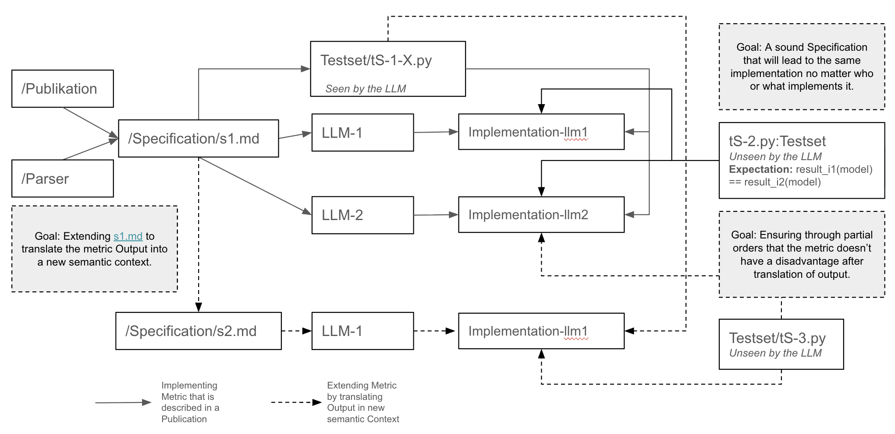

# domain-model-metrics

[](https://github.com/VasiliySeibert/domainModel-Metrics-Comparison/actions/workflows/ci.yml)
[](./LICENSE)
[](https://www.python.org/)
[](https://zenodo.org/)

A pip-installable research-software release of five PlantUML
class-diagram similarity metrics, evaluated on a fixed 39-pair
benchmark with human F1 as ground truth. The package is
FAIR4RS-aligned: persistent identifiers (concept + version Zenodo
DOIs), rich metadata (`CITATION.cff` + `codemeta.json`), version-pinned
dependencies, tests, and an MIT license.

Quick start:

```bash
pip install "git+https://github.com/VasiliySeibert/domainModel-Metrics-Comparison@v1.0.0"
```

```python
from domain_model_metrics import get_metric
m = get_metric("metrik-1")                       # or metrik-2 .. metrik-5
result = m.compute(ref_plantuml, gen_plantuml)
# {"class_score": 0.65, "attribute_score": 0.42, "association_score": 0.16}
```

---

## Table of contents

1. [Installation](#installation)
2. [Quick start](#quick-start)
3. [The five metrics](#the-five-metrics)
4. [Results](#results)
5. [Implementation methodology](#implementation-methodology)
6. [Discussion](#discussion)
   - [RQ1: Central tendency](#rq1-central-tendency)
   - [RQ2: Consistency of distance](#rq2-consistency-of-distance)
   - [Risk 1: Metric implementation correctness](#risk-1-were-the-metrics-implemented-correctly)
   - [Risk 2: Projection validity](#risk-2-did-the-metrics-suffer-an-unfair-disadvantage-through-the-projection)
   - [Validity of the human F1 ground truth](#validity-of-the-human-f1-ground-truth)
   - [Reusability](#reusability)
7. [Repository layout](#repository-layout)
8. [How this repository maps to FAIR4RS](#how-this-repository-maps-to-fair4rs)
9. [Citing this software](#citing-this-software)
10. [License](#license)
11. [Acknowledgement](#acknowledgement)

---

## Installation

From PyPI (once a release is published):

```bash
pip install domain-model-metrics
```

From a git tag (e.g. for v1.0.0 reproducibility):

```bash
pip install "git+https://github.com/VasiliySeibert/domainModel-Metrics-Comparison@v1.0.0"
```

For local development (with the optional analysis / notebooks / dev
extras):

```bash
git clone https://github.com/VasiliySeibert/domainModel-Metrics-Comparison
cd domainModel-Metrics-Comparison
pip install -e ".[dev,analysis,notebooks]"
```

> **Note** — Metrik-4 and Metrik-5 use NLTK / WordNet. After installing,
> download the required corpora once:
>
> ```bash
> python -m nltk.downloader wordnet omw-1.4 stopwords averaged_perceptron_tagger punkt
> ```

## Quick start

Compute the similarity between two PlantUML strings:

```python
from domain_model_metrics import get_metric

m = get_metric("metrik-1")                       # or metrik-2 .. metrik-5
result = m.compute(ref_plantuml, gen_plantuml)
# {"class_score": 0.65, "attribute_score": 0.42, "association_score": 0.16}
```

Run all 5 metrics on the bundled 39-pair benchmark:

```python
from domain_model_metrics import get_metric
from domain_model_metrics.workflow import MetricWorkflow

for name in ("metrik-1", "metrik-2", "metrik-3", "metrik-4", "metrik-5"):
    m = get_metric(name)
    wf = MetricWorkflow(m, dataset_path="data/combined-data.json",
                        output_dir=f"results/{name}")
    wf.run()
    wf.save(f"results/{name}.json")
```

Run the cross-metric comparison from the CLI:

```bash
python -m domain_model_metrics.compare          # print MAD table + RQ2 + decision table
python -m domain_model_metrics.compare --self-test   # also write PNG + JSON to cwd
```

Or explore the walkthrough notebook:

```bash
jupyter lab Notebooks/quantitative_results_walkthrough.ipynb
```

## The five metrics

Each metric takes two PlantUML strings (reference + generated) and
returns a 3-score dict in `[0, 1]` — one score per human-evaluated
category (Class, Attribute, Association).

| # | Method |
|---|---|
| **Metrik-1** | Rule-based mistake detection (greedy class match + mistake patterns). |
| **Metrik-2** | Graph edit distance on attributed UML class graphs, with Hungarian assignment for internal features. |
| **Metrik-3** | UML Common Graph (UCG) structural similarity with intra-cluster and inter-cluster edit distance. |
| **Metrik-4** | Semantic + structural pipeline: WordNet-based class-name similarity combined with structural GED (projection v1). |
| **Metrik-5** | Semantic + structural pipeline: WordNet-based class-name similarity combined with structural GED (projection v2). |

The canonical orchestrator for each metric is loaded on demand and
wrapped in the uniform `MetricProtocol` adapter that `get_metric()`
returns.

Each `Metric-Implementation/Metrik-N/` directory also keeps two
earlier design iterations (`Implementation-1/`, `Implementation-2/`
for Metrik-1..3; `Implementation_1/`, `Implementation_2/` for
Metrik-4..5) as design history, plus a `Parser/` directory (per-metric
PlantUML parser) and a `Testset/` directory (invariant validators).

## Results

The 39-pair benchmark was executed once and the resulting JSONs are
bundled at `Quantitative-Analysis/Results/results_metrik{1..5}.json`.
Each metric's score on each (model, setting) pair was compared to the
human expert F1 ground truth for Class, Attribute, and Association,
yielding the per-pair signed delta `metric_score − human_f1`.

Two research questions are addressed:

- **RQ1** (central tendency): how close, on average, is each metric to
  the human F1 across the 39 pairs?
- **RQ2** (consistency of distance): how consistent is each metric's
  per-pair distance from the human F1?

The RQ1 statistic is the **MAD** (mean absolute delta
`|metric_score − human_f1|`); the RQ2 statistics are the **residual
std** of the signed deltas (spread around the mean), the **|bias|**
(constant offset, calibratable by subtraction), and the **Pearson r**
(linear correlation between the metric score and the human F1 across
pairs — high r means the metric preserves the per-pair ordering).
The comparison is per-element — Class, Attribute, Relationship — for
the 39 (model, setting) pairs.

### Table 1 — Per-element MAD, residual std, |bias|, and Pearson r

**Best value per column in bold;** lower is better for MAD, r.std,
and |bias|; higher is better for r. Numbers are at 2-decimal precision;
full-precision values are in `Quantitative-Analysis/Results/`
(`results_metrik{1..5}.json` and the cross-metric table
`metrics_comparison.json`).

| Metrik | Class MAD | Class r.std | Class \|bias\| | Class r | Attr MAD | Attr r.std | Attr \|bias\| | Attr r | Rel MAD | Rel r.std | Rel \|bias\| | Rel r |
|-------:|----------:|------------:|---------------:|--------:|---------:|-----------:|--------------:|-------:|--------:|----------:|-------------:|-------:|
| M-1    | 0.15      | 0.09        | 0.14           | 0.37    | 0.23     | 0.19       | 0.19          | 0.23   | **0.13**| 0.15      | 0.08         | -0.13  |
| M-2    | 0.19      | 0.12        | 0.18           | 0.30    | 0.15     | 0.17       | **0.06**      | 0.18   | 0.18    | 0.13      | 0.17         | 0.37   |
| M-3    | 0.17      | 0.09        | 0.17           | 0.36    | 0.21     | **0.12**   | 0.21          | **0.65** | **0.13** | 0.16   | **0.00**     | 0.05   |
| M-4    | 0.09      | **0.07**    | 0.07           | **0.42**| **0.14** | 0.15       | 0.09          | 0.32   | 0.27    | **0.11**  | 0.27         | **0.42** |
| M-5    | **0.07**  | 0.09        | **0.03**       | 0.18    | 0.15     | 0.15       | 0.10          | 0.38   | 0.26    | **0.11**  | 0.26         | 0.20   |

The three per-element narratives:

**Class.** The class MAD spreads from 0.07 to 0.19. M-5 is closest to
the human F1 on average (MAD 0.07, bias 0.03, r.std 0.09). M-4 is a
close second on MAD (0.09) and has the tightest spread (r.std 0.07)
and the highest Pearson r (0.42) — M-4 preserves the per-pair ordering
of the human F1 better than any other metric on Class. M-1 sits in the
middle (MAD 0.15, r.std 0.09, bias 0.14, r 0.37); M-3 is similar to
M-1 (MAD 0.17, r 0.36) but with a larger bias (0.17). M-2 is the
weakest on Class: the highest MAD (0.19), highest r.std (0.12),
highest bias (0.18), and second-lowest r (0.30). **The Class column
admits no single dominant metric**: the metric with the lowest MAD
(M-5 at 0.07) is not the metric with the lowest r.std (M-4 at 0.07)
or the highest r (M-4 at 0.42).

**Attribute.** The attribute MAD spreads from 0.14 to 0.23. M-4 is
closest to the human F1 on average (MAD 0.14, bias 0.09, r.std
0.15). M-3 has the tightest spread (r.std 0.12) and at 0.65 the
highest Pearson r in the entire 15-row table — M-3 preserves the
per-pair ordering of the human attribute F1 better than any other
metric on any element. M-2 has the smallest bias (0.06) but a middling
MAD (0.15) and a low r (0.18); being centred on average does not
translate into per-pair ranking accuracy. M-5 is comparable to M-2 on
MAD (0.15) and r.std (0.15) but achieves a higher r (0.38). M-1 is the
weakest on Attribute: the highest MAD (0.23), highest r.std (0.19),
highest bias (0.19), and a low r (0.23). **The Attribute column
admits no single dominant metric**: the metric with the lowest MAD
(M-4 at 0.14) is not the metric with the lowest r.std (M-3 at 0.12)
or the highest r (M-3 at 0.65).

**Relationship.** The relationship MAD spreads from 0.13 to 0.27 —
the widest spread in the table. M-1 and M-3 tie for the lowest MAD
(0.13) but differ sharply on the other three statistics. M-3 is
centred on the human (bias 0.00, r.std 0.16). M-1 carries a bias of
0.08 (r.std 0.15) and at **−0.13** the only *negative* Pearson r in
the entire table — M-1 actively **inverts** the per-pair ordering of
the human F1. M-3's r of 0.05 is near-zero — M-3 is centred on the
human on average but provides no per-pair ranking information. M-4
and M-5 tie for the tightest spread (r.std 0.11), and M-4 has the
highest r in the column (0.42), but both carry the highest MADs
(0.27 and 0.26) and the highest bias values (0.27 and 0.26) — they
are consistently off by a large constant amount despite preserving
the per-pair ordering better than any other metric. M-2 sits in the
middle (MAD 0.18, r.std 0.13, bias 0.17, r 0.37). **The trade-off is
at its starkest here**: the metrics that are closest to the human on
average (M-1 and M-3 at MAD 0.13) are the metrics with the worst
ranking performance (M-1 at r −0.13, M-3 at r 0.05), while the metric
with the best ranking (M-4 at r 0.42) is the metric with the worst MAD
(0.27).

## Implementation methodology

The five metric implementations follow a uniform **spec → invariants →
`@icontract` → code** design-by-contract pattern. Each metric is
first restated as a specification — a markdown file plus a Python
skeleton with `@icontract.require` / `@icontract.ensure` decorators
— before any code is written. The specification is then handed
unchanged to two independent large language models through the same
agentic harness, and the two implementations are required to produce
identical output on all 39 comparisons. The specification, not the
code, is the artefact the comparison is audited against; a reviewer
can audit each metric's spec at
`Metric-Implementation/Metrik-N/Specification/s1.md`.



*Figure: the spec → invariants → `@icontract` → code pattern. The
diagram is the visual counterpart of the dual-LLM agreement protocol
described in §Discussion §Risk 1 below: each specification is handed
unchanged to two independent LLMs, the implementations are run on the
39 comparisons, and agreement on every pair is taken as evidence that
the specification is unambiguous.*

The residual risk is that the agreement test checks **agreement
between the two implementations, not agreement between the
specification and the source description** — a misreading consistent
across both LLMs is invisible to the agreement test. See
[§Discussion §Risk 1](#risk-1-were-the-metrics-implemented-correctly)
for the full discussion.

## Discussion

This section interprets Table 1 above: what the numbers mean and how a
practitioner should pick a metric.

### RQ1: Central tendency

The spread of MADs within each column — 0.07 to 0.19 on Class, 0.14 to
0.23 on Attribute, 0.13 to 0.27 on Relationship — shows that the choice
of metric changes the average distance by up to a factor of two on a
given element. The answer to RQ1 is therefore **per-element**: the
metric with the lowest MAD on the element of interest is the closest on
average, but no single metric is closest on all three elements. Even
the best MAD on the Relationship element (0.13) corresponds to a
metric whose per-pair ordering is uninformative, so closeness on average
does not by itself justify substituting the metric for the human.

### RQ2: Consistency of distance

The per-comparison distance is best preserved by **different metrics on
different elements**: Metrik-4 on Class with Pearson r = 0.42,
Metrik-3 on Attribute with r = 0.65, and Metrik-4 again on Relationship
with r = 0.42. The winners per (element, statistic) are summarised
below; values are from [Table 1 above](#table-1--per-element-mad-residual-std-bias-and-pearson-r).

| Element     | RQ1 best (lowest MAD)         | RQ2 best (lowest ResStd) | RQ2 best (highest r) |
|-------------|-------------------------------|--------------------------|----------------------|
| Class       | Metrik-5 (MAD = 0.07)         | Metrik-4 (r.std = 0.07)  | Metrik-4 (r = 0.42)  |
| Attribute   | Metrik-4 (MAD = 0.14)         | Metrik-3 (r.std = 0.12)  | Metrik-3 (r = 0.65)  |
| Relationship | **Metrik-1 and Metrik-3 (tie, MAD = 0.13)** | Metrik-4 (r.std = 0.11)  | Metrik-4 (r = 0.42)  |

**6 out of 6 picks differ.** The Association row is particularly
instructive: Metrik-1 and Metrik-3 *tie* for the lowest MAD, but they
are **not interchangeable**. Metrik-1 has `r = −0.13` — the only
*negative* Pearson r in the entire 15-cell table — meaning it
actively *inverts* the per-pair ordering of the human F1. Metrik-3 has
`r = 0.05` — statistically independent of the human F1. A practitioner
should pick neither: the trade-off is at its starkest here, and a tied
MAD that combines one inverting metric with one random metric is not a
robust choice.

#### Which metric should practitioners use?

The practitioner should pick the metric with the **highest per-element
Pearson r**: Metrik-4 on Class (r = 0.42), Metrik-3 on Attribute (r =
0.65), and Metrik-4 on Relationship (r = 0.42). Accepting that on
Relationship the best r carries the worst MAD (0.27), the bias is
almost entirely a constant offset (`|bias|/MAD = 1.00`, `bias = +0.274`,
`residual std = 0.113`), so a **linear rescaling** (slope `0.507`,
intercept `0.012`) removes the offset and drops the MAD from `0.274`
to `0.113`, making **Metrik-4 on Relationship the best on both MAD and
r simultaneously once calibrated** — the trade-off is not a property
of the metric but of the uncalibrated output.

#### Per-use-case selection

Pick a metric by **use case**:

- **Single quality score** (e.g., one overall number per
  LLM-generated diagram) → the **lowest MAD per element**.
- **Ranker / leaderboard** (e.g., "which of these 100 LLM-generated
  diagrams is best?") → the **highest Pearson r per element**.
- **Calibratable number** (e.g., you'll fit a linear regression to
  predict human F1 from the metric score) → look for
  `|bias|/MAD ≈ 1.0` with non-zero Pearson r — the worked example is
  Metrik-4 on Relationship described above, where the linear
  rescaling reduces the MAD from `0.274` to `0.113`.

Picking a metric is a **(RQ1, RQ2, use-case) design choice**, not a
"use the best one" choice.

#### Qualitative failure-mode patterns

The 15 (metric, element) cells fall into four qualitative patterns:

1. **Pure constant offset** — calibratable by a shift. Metrik-4 on
   Relationship: `MAD = 0.27`, `|bias| = 0.27`, `r.std = 0.11`,
   `r = 0.42`. The offset is almost entirely a constant shift
   (`|bias|/MAD = 1.00`); the linear rescaling above drops the MAD
   from `0.27` to `0.11`.
2. **Linear rescalable** — calibratable by slope + intercept.
   Metrik-4 on Class: `r = 0.42` is the highest in the column;
   the residual std is the tightest at `0.07`.
3. **Random noise** — uncorrectable. Metrik-3 on Relationship has
   `r = 0.05` — statistically independent of the human F1. A metric
   that is centred on the human on average provides no per-pair
   ranking information.
4. **Close but doesn't track ordering** — low MAD, low r. Metrik-5
   on Class has the lowest MAD (0.07) but `r = 0.18`; the metric is
   well-calibrated on average but disagrees about *ranking* the
   39 pairs.

### Risk 1: Were the metrics implemented correctly?

Two independent large language models implement the same
specification through the same agentic harness, and the two
implementations are required to produce identical output on all 39
comparisons, so that an ambiguity that one model resolves arbitrarily
is caught by the other model resolving it differently. The
specification, not the code, is the artefact the comparison is
audited against; the per-metric specs are bundled at
`Metric-Implementation/Metrik-N/Specification/` (`s1.md` and `s2.md`
files) and are open for review.

The residual risk is that the agreement test checks **agreement
between the two implementations, not agreement between the
specification and the source description** — a misreading consistent
across both LLMs is invisible to the agreement test. The
dual-implementation agreement therefore does not by itself certify
the audit; it only certifies that the specification is unambiguous
*between* the two implementations.

### Risk 2: Did the metrics suffer an unfair disadvantage through the projection?

Each metric emits a score in a different native unit; the comparison
requires each score to be translated into the per-element (Class,
Attribute, Association) F1 scale of the human ground truth. The
projection is validated by an ordering-preservation check: a pair
ranked more similar by the metric's native output must also be
ranked more similar by the projected per-element triple. The check
passes for all five metrics, which is the condition under which the
projected scores are used in the comparison. The residual risk is that
the projection check validates **ordering**, not absolute level: a
projection can preserve the partial order while shifting the absolute
scale.

### Validity of the human F1 ground truth

Three properties of the human F1 ground truth bound the validity of
the comparison:

1. **Number of raters.** The human F1 reflects a small consensus
   panel, not a representative sample of modelers. The
   central-tendency statistics (MAD, |bias|) should therefore be
   treated as **relative comparisons between metrics** rather than as
   calibrated estimates of the true human distance.
2. **Per-pair ordering generalises.** While limited in panel size, the
   consensus process does produce an ordering of the 39 pairs that
   aligns with human intuition about which diagrams are more
   similar, and that ordering is the part of the ground truth that
   generalises. It is less sensitive to rater panel size than the
   absolute F1 level, and it is the quantity that RQ2 (Pearson r)
   measures. **The per-pair ranking is therefore a more robust
   finding than the central-tendency comparison.**
3. **Scope of the reviewers' notion of equivalence.** The ground
   truth is scoped to a **semantic-equivalence** notion: two elements
   match if they refer to the same domain concept (the
   `c1`/`c2`/`c3`/`c4` grading scheme distinguishes exact match,
   semantically equivalent match, partial match, and no match). A
   practitioner whose notion of similarity is structural-only — two
   models are similar only if their structure matches — would find
   the human F1 over-credits transformations that several metrics
   structurally cannot detect, and the ground truth would be
   misleading for that use case without re-grading under the stricter
   notion.

The comparison is therefore valid as a test of each metric's per-pair
ranking against one documented human judgement under a
semantic-equivalence scope, and the absolute F1 values should not be
read as a population-calibrated scale.

### Reusability

All metric implementations, the dataset, and each comparison are
released in accordance with the FAIR4RS recommendations. See
[§"How this repository maps to FAIR4RS"](#how-this-repository-maps-to-fair4rs)
below for the principle-by-principle mapping.

## Repository layout

```
domainModel-Metrics-Comparison/
├── README.md                              # this file
├── LICENSE                                # MIT (SPDX: MIT)
├── CITATION.cff                           # CFF 1.2.0 metadata
├── codemeta.json                          # CodeMeta 2.0 metadata
├── CHANGELOG.md                           # versioned provenance
├── pyproject.toml                         # PEP 621 build + pinned deps
├── .github/workflows/ci.yml               # pytest on Python 3.11 + 3.12
│
├── Metric-Implementation/                 # the 5 metrics
│   ├── Metrik-1/
│   │   ├── Implementation-1/              # design iteration #1 (kept for history)
│   │   ├── Implementation-2/              # design iteration #2 (kept for history)
│   │   ├── Implementation-3/              # canonical, wired into the public API
│   │   ├── Parser/                        # PlantUML parser bundled per-metric
│   │   ├── Specification/                 # design specs (s1.md, s2.md, …)
│   │   └── Testset/                       # invariant validators
│   ├── Metrik-2/  (same layout)
│   ├── Metrik-3/  (same layout)
│   ├── Metrik-4/  (Implementation_1, Implementation_2, Implementation_3 + Parser + Specification + Testset + diss_metric_worker.py)
│   └── Metrik-5/  (same as Metrik-4)
│
├── Quantitative-Analysis/                 # the evaluation workflow
│   ├── Dataset/combined-data.json         # the 39-pair benchmark
│   ├── Workflow/                          # reusable metric-evaluation harness
│   ├── RunMetrics/                        # per-metric runnable scripts
│   ├── Results/                           # pre-computed per-metric results JSONs
│   │   ├── results_metrik{1..5}.json
│   │   ├── metrics_comparison.{json,png,scatter.png}
│   │   └── .baseline/                     # original results for reproducibility check
│   └── Notebooks/                         # (legacy; the new walkthrough is at /Notebooks)
│
├── Notebooks/
│   └── quantitative_results_walkthrough.ipynb   # narrated walkthrough of the results
│
├── src/domain_model_metrics/              # the pip-installable package
│   ├── __init__.py                        # public API: get_metric, MetricResult, MetricProtocol
│   ├── metrics/
│   │   └── _factory.py                    # importlib-based loader for the 5 canonical orchestrators
│   ├── workflow/
│   │   └── __init__.py                    # re-export of Workflow package
│   └── compare.py                         # CLI: cross-metric comparison (domain-model-metrics-compare)
│
├── data/
│   └── combined-data.json                 # mirror of Quantitative-Analysis/Dataset/combined-data.json
│
└── tests/
    ├── conftest.py
    ├── _fixtures.py                       # LabTracker_0shot pair, tiny pair
    ├── test_api_imports.py
    ├── test_metrics_protocol.py
    └── test_workflow_smoke.py             # asserts the bundled JSONs are reproducible
```

## How this repository maps to FAIR4RS

This release is modelled on the [FAIR4RS
principles](https://www.rd-alliance.org/group/fair-principles-research-software-working-group)
(Research Data Alliance working group). The table below lists each
principle and the concrete artefact in this repository that realises it.

| FAIR4RS principle | Evidence in this repository |
|---|---|
| **F1 / F1.1 / F1.2** PID, component IDs, version IDs | [Zenodo DOI badge](#citing-this-software); the GitHub-Zenodo integration auto-mints a concept DOI and per-tag version DOIs on each release |
| **F2 / F3 / F4** rich, discoverable metadata | [`CITATION.cff`](./CITATION.cff) (CFF 1.2.0); [`codemeta.json`](./codemeta.json) (CodeMeta 2.0); [`pyproject.toml`](./pyproject.toml); this README |
| **A1 / A1.1** open retrieval | Public GitHub over HTTPS; `pip install` from PyPI or `git+https://…` from a tag |
| **A1.2** auth where needed | n/a — public repo |
| **A2** metadata persistence | Zenodo deposit (F1); Software Heritage archive is triggered automatically by each tag |
| **I1 / I2** standards, qualified refs | CFF 1.2.0, CodeMeta 2.0, SPDX license id (`MIT`), ORCID-qualified authorship, version-pinned dependencies, PEP 621 build metadata, PEP 561 `py.typed` marker |
| **R1.1** clear license | [`LICENSE`](./LICENSE) (MIT, SPDX: `MIT`) |
| **R1.2** provenance | git history + [`CHANGELOG.md`](./CHANGELOG.md) (Keep-a-Changelog format) + per-tag Zenodo DOIs |
| **R1.3** community standards | CFF 1.2.0, CodeMeta 2.0, PEP 621, PEP 561 |
| **R2** qualified refs to other software | Version-pinned dependencies in `pyproject.toml`; software references in `codemeta.json::softwareRequirements` |
| **R3** community standards | GitHub Actions CI; CFF / CodeMeta / PEP 621 / PEP 561 |
| **R3.1 / R3.2** tests, CI | `tests/` suite + `.github/workflows/ci.yml` (Python 3.11 + 3.12) |

## Citing this software

See [`CITATION.cff`](./CITATION.cff) — GitHub renders a "Cite this
repository" button on the sidebar that reads this file.

Each release is archived on Zenodo via the GitHub-Zenodo integration.

| Level | DOI |
|-------|-----|
| **Concept** (all versions) | _filled in after first GitHub Release_ |
| v1.0.0 | _filled in after first GitHub Release_ |

The Zenodo DOIs will be added after the GitHub-Zenodo integration
mints the concept + v1.0.0 version DOIs for this repository.

Cite the **concept DOI** to identify the project across all versions;
cite the specific **version DOI** to identify the exact snapshot you
used.

## License

`domain-model-metrics` is released under the [MIT License](./LICENSE) —
SPDX identifier `MIT`.

## Acknowledgement

Developed by **Vasiliy Seibert** ([ORCID 0000-0002-7121-6816](https://orcid.org/0000-0002-7121-6816),
Institute for Software and Systems Engineering, TU Clausthal).